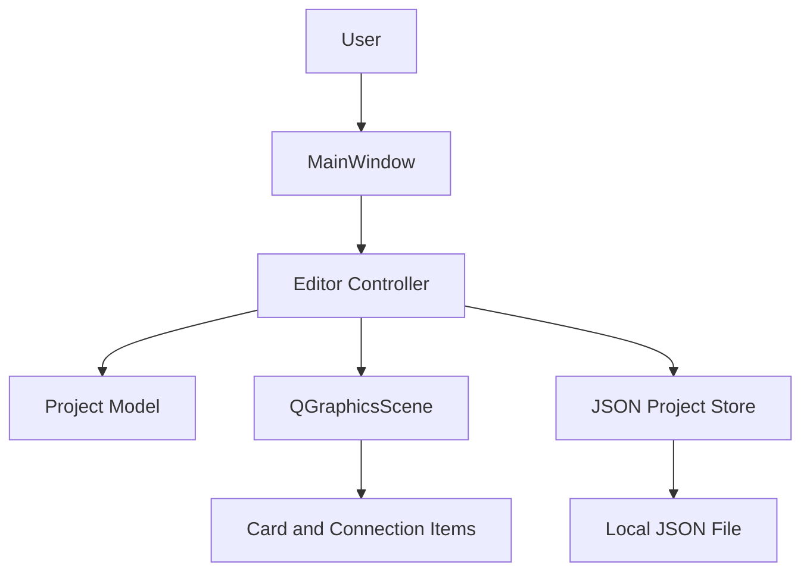

# Timeline Editor Design

**Spec**: `.specs/features/timeline-editor/spec.md`
**Status**: Draft

## Architecture Overview

The application will use a small layered desktop architecture. A pure project model owns cards, timelines, memberships, and connections. A JSON repository serializes and validates that model. PySide6 views translate user gestures into model commands and redraw the scene from model state.



The model is the source of truth. Graphics items do not own persistent data. A redraw can therefore reconstruct the view after loading, editing, moving, or deleting objects.

## Code Reuse Analysis

### Existing Components to Leverage

| Component | Location | How to Use |
| --- | --- | --- |
| Existing application code | None | The repository has no implementation or project conventions yet. |
| PySide6 graphics framework | External dependency | Use `QGraphicsScene`, `QGraphicsView`, and custom `QGraphicsItem` subclasses for the editor surface. |
| Python standard library JSON | Python runtime | Encode and decode the portable project format. |

### Integration Points

| System | Integration Method |
| --- | --- |
| Local filesystem | `QFileDialog` chooses paths; `ProjectStore` reads and writes UTF-8 JSON. |
| Desktop UI | `MainWindow` wires menus, toolbars, dialogs, and the graphics view to controller actions. |

## Components

### Project Model

- **Purpose**: Owns validated, serializable story data and mutation rules.
- **Location**: `src/time_spock/model.py`
- **Interfaces**:
  - `Project.add_card(title, description, color) -> Card`
  - `Project.update_card(card_id, ...) -> None`
  - `Project.delete_card(card_id) -> None`
  - `Project.add_timeline(name) -> Timeline`
  - `Project.add_membership(card_id, timeline_id, position) -> None`
  - `Project.remove_membership(card_id, timeline_id) -> None`
  - `Project.add_connection(source_id, target_id) -> Connection`
  - `Project.remove_connection(connection_id) -> None`
- **Dependencies**: Python dataclasses and UUID generation.
- **Reuses**: None; it is the new domain boundary.

Cards are stored once by card ID. Timeline memberships store the card ID, timeline ID, position, width, and height. Connections store their own ID plus source and target card IDs. Deleting a card removes memberships for that card and connections whose source or target matches it.

### Project Store

- **Purpose**: Persist and restore complete projects without partially replacing the active model.
- **Location**: `src/time_spock/storage.py`
- **Interfaces**:
  - `ProjectStore.save(project, path) -> None`
  - `ProjectStore.load(path) -> Project`
- **Dependencies**: `json`, `pathlib`, and model validation.
- **Reuses**: Python standard library JSON support.

The file includes a schema version and separate arrays for cards, timelines, memberships, and connections. Loading validates identifiers and references into a new `Project`; the controller replaces the active project only after loading succeeds.

### Graphics Scene

- **Purpose**: Render timelines, card instances, and directed connections while handling visual movement and selection.
- **Location**: `src/time_spock/ui/scene.py`
- **Interfaces**:
  - `EditorScene.render(project) -> None`
  - `EditorScene.card_moved(card_id, timeline_id, position) -> Signal`
  - `EditorScene.connection_requested(source_id, target_id) -> Signal`
  - `EditorScene.delete_selected() -> Signal`
- **Dependencies**: PySide6 and the project model's read interface.
- **Reuses**: `QGraphicsScene` and `QGraphicsView`.

Each timeline is rendered as a named horizontal region. A card membership renders one visual card instance, so a shared card appears in more than one region while retaining one model ID. New card placement searches a small grid for the first position that does not fully overlap an existing card. Connection paths are redrawn from the current positions of their endpoint instances and finish with an arrowhead. A resize handle changes the membership's width and height while preserving its position. If an endpoint has multiple memberships, the scene chooses the visible instance pair deterministically during rendering; the model connection remains global.

### Main Window and Controller

- **Purpose**: Coordinate commands, dialogs, dirty state, and scene updates.
- **Location**: `src/time_spock/ui/main_window.py`
- **Interfaces**:
  - `MainWindow.new_project() -> None`
  - `MainWindow.open_project() -> None`
  - `MainWindow.save_project() -> None`
  - `MainWindow.save_project_as() -> None`
  - `MainWindow.confirm_discard_if_dirty() -> bool`
- **Dependencies**: PySide6, `Project`, `ProjectStore`, and `EditorScene`.
- **Reuses**: Qt menus, actions, file dialogs, message boxes, and signals.

The controller marks the project dirty after every model mutation and clears the flag after a successful save or load. Failed loads leave both the active model and dirty state unchanged.

### Application Entry Point

- **Purpose**: Create the Qt application and show the main window.
- **Location**: `src/time_spock/main.py`
- **Interfaces**: `main() -> int`
- **Dependencies**: PySide6 and `MainWindow`.
- **Reuses**: None.

## Data Models

```python
@dataclass
class Card:
    id: str
    title: str
    description: str
    color: str

@dataclass
class Timeline:
    id: str
    name: str

@dataclass
class Membership:
    card_id: str
    timeline_id: str
    x: float
    y: float
  width: float
  height: float

@dataclass
class Connection:
    id: str
    source_id: str
    target_id: str

@dataclass
class Project:
    cards: dict[str, Card]
    timelines: dict[str, Timeline]
    memberships: list[Membership]
    connections: dict[str, Connection]
```

**Relationships**:

- A project has many cards, timelines, memberships, and connections.
- A membership references exactly one existing card and one existing timeline.
- A connection references exactly two existing cards and preserves source-to-target direction.
- A card may have zero or many memberships and connections.
- A timeline may have zero or many memberships.

## Error Handling Strategy

| Error Scenario | Handling | User Impact |
| --- | --- | --- |
| Empty card title | Reject the model mutation and show a validation message. | The card remains unchanged or is not created. |
| Missing connection endpoint | Reject the model mutation. | No connection is created. |
| Missing, malformed, or incompatible JSON | Catch the load error and show a message with the path. | The current project stays open and unchanged. |
| Save failure | Report the filesystem error and retain dirty state. | The user can retry or choose another path. |
| Destructive action with unsaved changes | Ask for Save, Discard, or Cancel. | The user controls whether work is discarded. |

## Risks & Concerns

| Concern | Location (file:line) | Impact | Mitigation |
| --- | --- | --- | --- |
| Shared cards can produce ambiguous visual endpoints for a global connection. | `src/time_spock/ui/scene.py` | A cross-timeline edge could be visually unclear when both endpoints appear multiple times. | Keep the model connection global, render deterministic endpoint pairs in MVP, and document a later routing enhancement if needed. |
| No existing test or packaging setup exists. | Repository root | Regressions could be detected late and the application may be hard to run. | Add model/storage tests first and provide a minimal `pyproject.toml` with a documented run command. |

## Tech Decisions

| Decision | Choice | Rationale |
| --- | --- | --- |
| Desktop UI toolkit | PySide6 | Supports the chosen Python stack and the required 2D graphics interactions. |
| Scene implementation | `QGraphicsScene` with custom graphics items | Separates visual items from the domain model and supports moving/selecting objects. |
| Persistence format | Versioned JSON | Portable, inspectable, and sufficient for the local MVP. |
| Position semantics | Position stored per card membership | The same card can occupy different visual positions in different timelines. |
| Connection semantics | Global source and target card IDs | Relationships remain intact when cards are shared across timelines. |

## Requirement Mapping

| Requirement Group | Design Coverage |
| --- | --- |
| CARD-01..06 | `Project` validation and deletion cascade. |
| LINK-01..05 | `Connection` model and `Project` connection operations. |
| LANE-01..05 | `Timeline`, `Membership`, and repeated visual card instances. |
| FILE-01..05 | Versioned `ProjectStore` and controller dirty-state flow. |